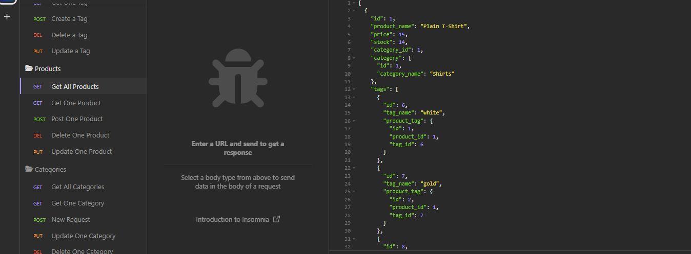

# E-commerce 

## Description 

Welcome to the repository of the E-commerce back end server! In this repository you will find the code that allows you to create a server via express, and a database with mysql. You can link the database with expresss via sequelize. You also will find a seeds js which will populate the database created inside the models folder! This repository also uses and env file to safely store the database name, user and password. The endpoints created in the routes folders can be tested in insonmia.

## Usage 

To use this programm, you will need to install npm and the necessary dependencies such as dotenv, mysql2, sequelize and express. Once you have all of that installed you need to run in the mysql shell the schema and populate the models, and then you will be able to see the models formatted in a json file in a insonmia once you have started the server with 
                                        npm start 

https://drive.google.com/file/d/1m-dMezRZpyvuoV6KmwAwtdKezmzq5Dzr/view

## Licence

This repository is licenced under the MiT licence. 